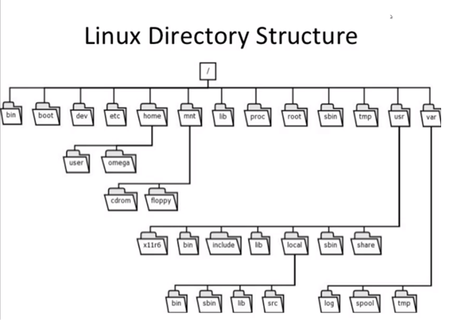

# Linux

## 103 Comando GNU E Unix

### 103.1 Trabalhando com linha de comando (4 Peso)

#### Tipos de Shell

- Sh -
- Csh – Implementa recurso da linguagem C
- sh -
- Bash – evolução do csh

Como saber ?

```bash
Echo $SHELL
```

Comandos externos e internos

- Type echo
- Bultin(comando interno)
- Command is Hashed(cache interno)
- Command is /bin/tar (programa interno)
- \*is hashed(/usr/bin/clear) – está em cache
- Echo $PATH(Exibe os diretórios que estão no caminho), indica os caminhos onde o Type irá pesquisar para encontrar os comandos/programas externos

E se não estiver no $PATH?

- Preciso localizar o programa

### variaveis

- Local: processos iniciados a partir do shell não enxergam a variável.
  -Como exportar

```bash
	Export “nome da variável”
```

- Posso criar a variável já exportada (export Nome_variavel =valor)
- Set – mostra todas as variáveis
- Env – Mostra apenas as variáveis que são globais, o que foi exportado,
- Pode alterar o valor da variável para uma execução.
- Unset – remove uma variável
- Algumas variáveis interessantes
- HISTFILE = Mostra onde está o arquivo com o histórico de comando
- LOGNAME = Quem fez o login nesta sessão.
- PWD = Diretório em que você está.
- TERM = Qual interface gráfica você está.

Variáveis dinamicamente definidas pelo shell, são definidas pelo shell.

Exemplos

- \$$ Mostra o PID do processo atual (do shell ou script que esteja executando)
- $! Mostra o último processo executado em background.
- $? Mostra o código de retorno do último código que você executou.
- ~ Mostra o home do usuário atual
- ~ + nome do usuário, mostra o home do usuário root
- Mais algumas variáveis de ambiente
- DISPLAY: Indica às aplicações gráficas onde as janelas deverão ser exibidas. Será estudado no Tópico 106.
- HISTFILE: Arquivo do histórico de comandos
- HISTFILESIZE: Quantidade de linhas/comandos armazenados no arquivo de histórico
- HOME: Indica o diretório do usuário atual
- LOGNAME e USER: Nome do usuário atual
- PATH: Diretórios em que o Linux irá procurar por arquivos executáveis
- PS1: Aparência do prompt do shell.
- PWD: Diretório atual
- OLDPWD: Diretório anterior

Executando comandos em sequência: a cada comando, digite o ; (ponto e vírgula)

& (e comercial): executa o segundo comando se o 1º for executado com sucesso.

||(Pipe Pipe): executa o segundo independente do 1º.

- History: exibe os seus últimos comandos
- !!: repete o último comando executado
- !n: n sendo o número do comando, ele repete o comando executado
- ![string]: executa o último comando que contém a string
- Como limpar? History -c
- Set | grep HISTFILE
- CTRL+ R : pesquisa do comando executado

### Como obter ajuda? Man [comando]

- Dentro do man ,utilize [/string] para pesquisar
- Quando o comando é interno, você precisa pesquisar o manual do bash
- Info[comando] referência rápida do comando
- Man -k “system information”, exemplo, ele traz todos os comandos que contém o “system information”
- Whatis [comando], mostra a informação deste comando
- apropos, igual o man-k
- uname: imprime informações do sistema
- uname -r: versão do kernel
- alias: forma de criar um atalho para o comando
- alias lt=’ls /tmp’
- which : localiza um comando dentro dos diretórios da variáveis $PATH
- Quotting: Uso de aspas duplas, simples e barra de proteção(\escape).
  Exemplos:
  ```bash
  echo “*”, ele impede a execução do *, então só exibe o *
  ```
- Aspas duplas: protege todos exceto $cifrao /barra invertida e `crase

### 103.2 Aplicando filtros a textos e arquivos de textos

- Cat -n – todas as linhas numeradas
- Cat-b, todas as linhas, exceto as brancas
- Cat -s, transforma as linhas brancas em 1 linha só
- Cat -A, exibe caracteres especiais, tab e enter.
- Tac, imprime o arquivo de tras para frente.
- Head, exibe o cabeçalho do arquivo
- Head -n2, só as duas primeiras linhas
- Head -c100, só os cem primeiros bytes
- Tail -5, exibe as últimas 5 linhas
- Tail -f, exibe as linhas e aguarda a edição dos arquivos
- Less: faz a paginação dos arquivos. “barra de espaço” vai para a próxima pagina
- O “/” procura a palavra, n busca a próxima ocorrência e o N maiúscula volta a pesquisa.
- CTRL + G, status do arquivo
- Wc, lê as quantidadades de palavras,linhas,bytes e caracteres.
- Nl – le o conteúdo, numera as linhas e desconsidera as linhas em branco
- Sort – ordena o arquivo
- Sort -r – ordena de maneira reversa
- Sort -k2, ordena pelo segundo campo
- Uniq: apenas ocorrências únicas e sequenciais
- Uniq –d mostra apenas linhas duplicadas
- Uniq -c mostra as linhas duplicadas e contadas
- Expand – converte de tab para espaços, sem alterar, apenas trata
- Unexpand -a – converte espaços para tab, sem alterar, apenas trata
- Expand -t 5 -a - altera quantos caracteres viram um tab
- Od- Exibe o conteúdo de um texto em formato octal.
- Od -tx – exibe em hexadecimal
- Join - combina dois arquivos através de um índice
- Paste – combina linha a linha
- Spilt – l20 – divide um arquivo em vários outros.
- Split -b100 : divide em 100 bytes
- Tr – pegar um conteúdo e substituir ou deletar. No Tr nós informamos via pipe ou redirecionamento de entrada.
- Exemplo

```bash
cat alunos.txt | tr a-z A-Z  && cat alunos.txt | tr [:upper:] [:lower:] && cat alunos.txt | tr " " "_"
```

- Exemplo 2

```Bash
echo "curso de Linuuux" | tr -s u
```

- Fmt – formata uma saída de texto, vamos supor que você queira reduzir o tamanho da linha na tel. Ele tem o padrão de 75 caracteres por linha, você pode modificar com o parâmetro “-w”.
- Pr -l 50 - Prepara o arquivo para a impressão. {o -l 50 define que é 50 linhas por pagina}
- Exemplo:

```Bash
pr -l 30 -h "Curso LPI 1"  arquivolongo.txt
```

Cut – recorta partes de um texto.

```bash
cut -c5-10 alunos.txt

cut -b1-5 alunos.txt
```

- Cut -d” “ -f1 alunos.txt. Define o delimitador e exibe somente o campo1.
- Sed – usado para procurar um conteúdo e substituir o conteúdo.

```Bash
Sed ‘ s/Silva/Souza’ arquivoaluno.txt #somente uma vez
Sed ‘ s/Silva/Souza/g’ arquivoaluno.txt #funciona de forma recursiva
Sed ‘3,5 d’ arquivoaluno.txt
Sed ‘/Claudia/d’ arquivoaluno.txt
```

- Xzcat - le o arquivo do tipo texto compactado xz
- Bzcat - le o arquivo do tipo texto compactado bz
- Zcat - le o arquivo do tipo texto compactado gz

- Algoritmos de arquivos – analisa o arquivo e cria uma sequencia de caracteres que representa estes arquivos.

      - Md5sum
      - Csha256sum
      - Sha512sum
      - Sha1sum

  Exemplos:

```Bash
Sha256 arquivo.iso
Sha256sum -c arquivo #compara o arquivo sum com os outros arquivos do diretório e informa qual está igual.
```

### 103.3 – Gerenciamento básico de arquivos


- Cd - – volta o caminho que vc estava
- Cd ~ - volta para o seu home
- Ls -a – Arquivos ocultos
- Ls -l – Lista detalhada de arquivos
- Ls -h – Lista de forma humana
- Ls -R -Recursivo
- ls -l Aula1\* - exibe todos que comecem com Aula1 independente do final.
- Ls -l aula[!123] – Exibe tudo que não tenha 123.
- Ls -l A{ula,ULA}1 – Exibe todos arquivos com o nome de Aula em minúsculo ou maiúsculo.
- Comando File – analista o arquivo e mostra o tipo dele.
- Cp -opcoes, origem e destino – faz a cópia de aquivos
- Cp -i - Pergunta se tem um arquivo a ser sobrescrito
- Cp -r – Copia de forma recursiva.
- Cp -p – Preserva as características do arquivo.
- Touch – Serve para criar um arquivo em branco e também muda a hora da última alteração ou acesso.

```bash
	Touch Aula3
	Touch -a altera a data do último acesso
	Touch -m altera a data da modificação.
	Touch -t 2020010111000 aquivo

```

- Rm -i – Remove e questiona se você quer remover os arquivos/diretório.
- Rmdir – só remove diretórios vazios
- Mkdir -p – Cria toda a estrutura de subdireórios
- Find /home -name Aula10 – Procura no /home o arquivo que contém o nome “Aula10”
- find ./ -ctime -1 – Procura todos os arquivos que foram modificados 1 dia antes
- Tar -c – Criar, x – Extrair, t – Listar os arquivos

```bash
	Tar cf backup.tar- Cria o arquivo, p – preserva as propriedades
	Tar cpvf backup.tar novo* - cria um arquivo de backup com todos com o nome Novo
	tar -cpvf backup.tar Exemplos/Curso*
```

```bash
$gzip -k backup.tar  #mantém o arquivo de origem
$ backup.tar  backup.tar.gz
```

- gunzip backup.tar.gz ou gzip -d- descompacta

```bash
	$ bzip2 -k backup.tar
	$ backup.tar  backup.tar.bz2
```

- Bzip2 -d ou bunzip2 - descompacta

```bash
	$ xz -k backup.tar
	$ backup.tar.xz
```

- Unxz ou xz -d - descompacta

#### Nomemclaturas

- Z gzip, j - bzip2, J – XZ
- F – Indica o caminho, p, manter as permissões

```bash
$Tar zcvpf bacup2.tgz novo*
```

- Descompactando - Gzip – gzip -d ou gunzip - Bzip2 -bzip2 -d ou bunzip - Xz – xz -d ou unxz
  Eu descubro como o arquivo foi compactado usando o comando file.

- Cpio- Necessita de uma lista de arquivos para criar um arquivo agrupado

```bash
$find ./ -name “novo*” | cpio -o > backup.cpio
$find ./ -name “novo*” | cpio -o | gzip> backup.cpio.gz
$cpio -i < backup.cpio (descompacto)
$cpio -d -i < backup.cpio – descompacta e cria o diretório
$gunzip -c backup.cpio.gz | cpio -i – descompactando com o gzip
```

- dd – usado para copiar uma partição inteira, copia byte a byte
- DD if=/dev/sr0 of=imagem.img

### 103.4 Fluxos, pipes e redirecionamentos

- Todo Programa no Linux recebe tres escritos, Entrada padrão, saída padrão e saída com erro

- \> Se existir, sobresceve. Se não existir ele cria a saída.
- \>> Append, inseri o resultado no final do arquivo.
  - 1> O 1 é omitido, é o código do std out.
  - 2> Redireciona o erro do comando
- Ls -l {Aula,AULA}3> Saida-ls.out 2>&1 : Saída padrão e erro para o mesmo lugar

```bash
Cat alunos.txt | tr ‘a-z’ ‘A-Z’
Sort alunos.txt | uniq -d
```

- Tee – exibe na tela e escreve no arquivo

```bash
Ls -l /tmp | tee novo-arquivo-log
```

Xargs, pega a saída de um comando e envia para o outro comando. Linha por linha

```bash
Find /home -name “Aula3*”
Find /home -name “Aula3*” | xargs ls-l
```

- `Crase: executa primeiramente o comando e coloca junto com outro comando.

```bash
Echo “ a versão do kernel é: “`uname -r `
```

#### Outros redirecionamentos

O << é usado quando você deseja inserir um conteúdo interativamente, até que informe seu fim. Por exemplo:

```bash
$ tr a-z A-Z << final
> Curso Preparatoria para Certificacoes
> lpic-1
> comptia linux+
> final

```

- Veja que a string "final" (pode ser qualquer string) vai informar ao shell que a entrada termina naquele ponto, e então ele irá enviar essa entrada ao comando tr.
- O outro redirecionador é o <<<, que é chamado de "here string". Ele simplesmente redireciona o que o segue como se fosse o conteúdo de um arquivo texto. Por exemplo:

```bash
$ tr a-z A-Z < teste.txt
bash: teste.txt: Arquivo ou diretório não encontrado

$ tr a-z A-Z <<< teste.txt
TESTE.TXT
```

### 103.5 Criar, monitorar e encerrar processos

- PID – Process ID.
- PPID – Parent Process ID (processo pai)
- Primeiro processo é sempre o INIT, seu ID é 1.
- Ps – Exibe os processos rodando neste terminal.
- PS -u – Mostra os processos do usuário.
- PS -ux – Esta mostrando processo que não foram iniciados diretamente no TTY.
- PS -uxa – Mostra os processos de todos os usuários.
- PS -uxaf – Mostra os processos em formato de arvore.
- PS -lxa – Mostra o ID do usuário e et.
- PS -axu | grep photo – Exibe os processos e adiciona aos filtros
- PS -u -C VBoxClient – Lista os processos do VBoxClient
- Pstree – Mostra os processos em formato de uma arvore
- Systemd – o init era o sistema de gerenciador principal, porém hoje outros sistemas gerenciadores de processo são usados.
- Pgrep – Mostra os ID do processo de acordo com os parâmetros
- Psgrep bash – mostra os ID dos processos do bash

Comando TOP

- Exibe informações gerais da máquina e dos processos.
- Load average: mostra qual o tamanho da fila e que estão executados, valor ótimo é abaixo de 1.
- TOP -b – joga informação na tela
- Top -b -d3 – Delay de 3 segundos
- Top -b -d2 -n5 > process-linux. A cada 2 segundos execute por 5 vezes o comando e joga o arquivo.
- Kill – manda sinais a um processo.
- Kill -l – mostra todos os sinais que eu posso mandar para um processo.
- SIGHUP – terminar, reiniciar ou pode fazer a releitura das configurações
- SIGINT – interrompe o processo.
- SIGQUIT – fecha o processo, normalmente para.
- Kll – Encerra o processos.
- SIGTERM – Solicita ao processo que sinalize.
- Kill all – mata o processo baseado no nome.
- Pkill – encontra o processo e mata.
- Free – quantidade de memória e swap do sistema
- Free -m – exibe em mega
- Free -g – exibe em giga
  - Used – esta reservada(alocada) para o uso, sua preocupação deve ser em torno da SWAP.
- Screen – usado para trabalhar em varias abas.
  - Ctrl+a +c , cria uma nova aba
  - Ctrl+a +n , altera as abas
  - Ctrl+a + D, sair da seção do screen
  - Screen -r, retorna a seção
- Processo & - Indica que você quer o processo em backgroud.
- Job – mostra os processo em background
- Ctrl + Z – coloco em stop o processo.
- Bg- coloca o ultimo processo em background
- Fg – coloca o ultimo processo em foreground
- Nohup – evita que os processos morram em caso de uma desconecção.

```bash
	$Nohup Firefox &
```

Watch – executa programa periodicamente exibindo resultados

```bash
watch date
Watch free -h
Watch “ps axu | grep Firefox”
Watch  -n1 “ps axu | grep Firefox”
```

- Tmux: Controla vários terminais em uma sessão só.
  - Ctrl+B+C : nova janela
  - Ctrl+D, novonome: renomeia a janela
  - Ctrl+B+P : Janela anterior
  - Ctrl+B+N : Proxima
  - Ctl+B+L: Última que vc estava
  - Ctl+B+W: Lista as jenalas que vc possui
  - Ctr+B+%: Abre um painel vertical
  - Ctr+B+seta: vai pro painel da direção da seta. / Ctrl+B+”: janela horizotal
  - Ctrl + B + D: Desatachar, sair do Tmux
- Tmux Attach -t 0: consegue conectar na antiga sessão
- Tmux ls : mostra as conexões do tmux
- Tmux new -s connection: abre uma nova conexão
- Ctrl + B +& : matar a conexão ou “tmux kill-session t 0”

### 103.6 Modificar a prioridade da execução de processos – Nice renice

- O Linux possui um algoritmo para definição de prioridade de processos.
- O Nice(NI) pode ser definida pelo usuário. [-20 ... +19], sendo o Menor valor, mais prioridade.
- Somente o administrador pode aumentar a prioridade de um processo.
- Nice -n 15 firefox &
- Nice –15 gnome-calculator &
- Nice –adjustment=-10
- Renice -n 8 20509 – altera a prioridade de um processo já iniciado.
- Renice 8 20509
- Renice -n 5 -u lpi1

### 103.7 Busca em arquivos de textos

- REGEX = Regular Expression, um conjunto que define um padrão de texto.
- Grep -c – Conta quantas ocorrências tem dentro do texto.
- Grep -i Ignora o case sensitive.
- Grep -r Linux t\*
- Grep -E, expande as expressões regulares, pode se usar o egrep também
- Fgrep, não aplica expressões regulares
- Grep -v – Não contém a palavra

- Egrep “b[aei]g” texto.txt, tudo que contém as letras
- Egrep “b[a-u]g” texto.txt, tudo que tem no meio as letras
- Egrep “^Linux” texto.txt, tudo que inicia com
- Egrep “Linux$” texto.txt tudo que termina com
- Egrep -v “^#” texto.txt, tudo que não contém no começo da linha
- Egrep “^$” texto, tudo que tenha linha em branco
- Egrep -v “^$” texto, tudo que não haja linhas em branco
- Egrep “b[a-i]g\*” texto, pode conter ou não conter o g e o resto é indefinido
- Egrep “b[a-i]g\*e” texto, em que o inicio seja B, apareça entre B e G o a-i, o G pode ou não aparecer e o caractere após deve ter a letra E.
- Egrep “b[a-i]g+e” texto, exige que a letra anterior apareça ao menos uma vez.
- Egrep “b[a-i]g?” exige que apareça uma ou nenhuma vez
- Egrep “b[a-i]g.” texto, exige que tenha uma letra depois da palavra.
- Egrep “O.\*Linux” texto, tudo que começa com O, tem um ponto e o resto não importa até o Linux.
- Sed ‘/Llinux/d’ texto.txt
- Sed ‘/^#/d’ texto.txt
- Sed ‘/[Ll]inux/d’ texto.txt
- Sed ‘s/[Ll]inux/Windows/’ texto.txt
- Egrep -i “Linux” texto.txt
- Egrep -i “Linux\.” texto.txt

- Grep ‘ba\{1,3\}h’ novotexto.txt : quero que o ba apareça de 1 a 3 vezes
- A principal diferença do grep pro egrep, é que a básica precisava proteger todos caracteres especiais

### 103.8 Edição básica com o Vi

- VIM – VI In proved, melhoramento do VI.
- Se digitado VI – version, veja se é mostrado o VI IMproved.

- Como editar?
  - Vi nomedoarquivo.txt. Caso ele não exista, o mesmo será criado.
- Mode ne navegação

  - / : procurar de cima para baixo, n = próxima ocorrência, shift + n ocorrência anterior
  - h – Move o caractere para traz
  - j – Desce para a próxima linha
  - k – Sobe uma linha
  - l – Próximo caractere
  - o – começa a inserir a partir da linha debaixo.
  - O – Começa a inserir a partir da linha decima
  - a – começa a editar a partir do próximo caractere
  - A – Começa e editar no final da linha.
  - Cc – Recorta e entra no modo de edição.
  - P – paste.
  - Dd – também recorta.
  - D 3 d – recorta as três linhas seguintes.
  - Yy – Apenas copia.
  - X – sai e salva
  - Wq! – sai, salva e ignora o comando.
  - ZZ – Sai e salva
  - :! Ls /tmp – executa o comando e não sai do arquivo
  - :e! – carrega as alterações do arquivo

- Nano

  - Os comandos são acessados através do Control+Letra
  - Alt + / final
  - Alt + \ começo
  - Control + V = próxima pagina
  - Pesquisar: control + w

- Emacs
  - Definindo Editor Padrão: select-editor ou update-alternatives - - config editor


## 101.1 Arquitetura do sistema

- BIOS – Basic Input Output System
- POST: Power-On Self-Test
- Gerencia Dispositivos, IRQ, I/O, DMA, etc.
- Inicia o processo de Boot
- EFI( Extensible Firmware Interface)
- UEFI(Unified EFI)
- IRQ – Interrupt request, sinal enviado para a CPU que o dispositivo pede sua execução.
  
- Como ver os mapeamentos: cat /proc/interrupts
- Endereços de I/O. Entrada de sistemas: cat /proc/ioports
  
- Endereços DMA: Canal do dispositivo para a memória diretamente
- Cat /proc/dma

- Barramentos
  - PCI: comando lspci
  - USB: comando lsusb
- Lsusb -s bus:device (mostr+a os detalhes)

- Partição virtual: contém informações do sistema em sua execução. Cada vez que liga a máquina, ele monta os dispositivos e dinamicamente vai sendo alterado

  - /proc: informações de processos ativos e recursos de hardware
  - /sys: informações sobre dispositivos de hardware(sysfs)
  - /dev: referências aos dispositivos do sistema, inclusive de armazenamento (udev)
  - Udev: = device mananger, ele que referencia os dispositivos no /dev
  - Dbus/hald = comunicação entre processos. Informa os processos a situação dos dispositivos de hardware.

- Cat /proc/cmdline: parâmetros que o bootloader passou para o kernel quando estava iniciando
- /proc/filesystem: os tipos de filesystem que podemos usar
- /proc/mount: as partições montadas no sistmas

- Udev
- Os axu | grep udev : Criar as ligações dos dispositivos conectados e monitora o que acontece no seu hardware.
- /lib/udev/rules.d : ações/regras de adição dos dispositivos
- /etc/udev/rules.d: o administrador pode criar suas próprias ações/regras

#### Dispositivos de armazenamento

- PATA ou IDE (Parallel Advanced Technology Attachment):
- /dev/hda ou das – Master
- /dev/hdb ou sdb – slave
- /dev/hdc ou sdc – máster
- /dev/hdd ou sdd – slave
- Hoje a maioria dos servidores mapeia como DAS e SDC porque são scsi

- SATA ( Serial Advanced Technology Attachment)
- /dev/sda – Primeiro Disco
- /dev/sdb – Segundo disco
- /dev/sdc – Terceiro disco

- SCSI (Small computer System Interface)
- Tipos
  - 8 bits(7 + controladora)
  - 16 bits(15 + controladora)
- SCSI_ID
- Canal – identificador de cada adaptador
- ID – identificador de cada dispositivo
- LUN – Número lógico da unidade
- Mapeados no Linux
  - /proc/scsi/scsi
- Outros dispositivos
- /dev/fd0 – disquete
- /dev/scd0 – SCSI CD-ROM
- /dev/sr0 – SCSI DvD.

- Modulos
- Todos dispositivo precisa de uma implementação de código, pode ser via código do kernel ou você tem módulos para cada um dos dispositivos. {equivalente aos drivers}
- Sempre estarão no /lib/modules
- Cada conjunto de módulos esta associada a um kernel
- Uname -r : verifica a versão do kernel
- /etc/modules: Você pode determinar quais módulos você quer que carregue obrigatoriamente

- Lsmod (/proc/modules)– lista os módulos carregados neste momento.
- Pode ser que um módulo tenha dependência: listado na coluna USED BY
- Modinfo “modulo”, exibe outras informações do modulo
- Rmmod “nomedomodulo” : Remover o Modulo
- Insmod “caminhodomodulo”, insmod /lib/modules/4.8.0-46-generic/kernel/drivers/input/mouse/psmoude.ko
- O Insmod não carrega as dependências.
- Modprobe(mapeia as dependências dos módulos) : modprobe bluecard_cs
- Modprobe -r bluecard_cs (remove)

Você pode usar arquivos de configuração para o modprob(/lib/mobdprod.d) para determinar ou configurar algo

### 101.2 – O boot do sistema

  

- Bootloader – Atualmente é o GRUB, antes era o LILO.
- MBR – Conjunto de dados que possui o boot loader(446 bytes), partition table(64 bytes) e validation check(2 bytes).
- Initrd/initramfs: filesystem temporário para dar suporte ao kernel
- INIT – Inicialization Process(Gerenciador de inicialização).
- É o processo com ID 1
- Os principais Inits são:
- sytemV – Init Original
- SystemD
- Upstart
- Dmesg | less– le as informações coletadas no boot.

Boot UEFI

- Não usa área de MBR.
- Consegue Lê as partições, identificar os bootloaders e lista-los
- Obtém bootloaders pelo ESP(EFI systm Partition
- Montada no /boot/efi
- Utiliza um filesystem do tipo FAT
- Utiliza (preferencialmente) partições GPT ao invés de MBR
- Suporta partições além do limite de 2TB
- Implementa o Boot Seguro (imagem kernel assinada)
- Possui compatibilidade com a BIOS
- Configurado pelo UEFI Boot Manager : efibootmgr

 

Características:

- Não le dados da MBR
- Obtem os bootloaders pelo ESP(EFI System Partition)
  - Montada no diretório /boot/efi
  - Utiliza um filesystem do tipo FAT
- Utiliza (preferencialmente) partições GPTO ao invés de MBR
- Suporta partições além do limte de 2 TB
- Journald – analisa informações e coleta logs, inclusive do boot
- Jornalctl – b : mostra informações do boot atual

### 101.3 – Alterar Runlevels, shutdown e reboot

- Principais gerenciadores
   - SystemV(init original) – SysV
   - Systemd - gerenciador compatível com o SysV com melhorias
   - Upstart – Novo gerenciador.
   - CFG Principal do systemV: /etc/inittab
- Diretórios de scripts
- /etc/init.d/
- /etc/rc.d/

- /etc/init.d
- Runlevel(qual runlevel vc esta usando)
- Telinit 2
- Telinit q – recarrega informações do init
- Init -u – re-execução do init
#### Systemd 
- Conteitos de Units e targets(conjunto de Units).
- Tipos
- Service
- Socket
- Device
- Mount
- Automount
- Target – runlevel
- Snapshcat
- Principal diretório /lib/systemd/system – tenho todas as configurações
- Systemctl – principal comando
- Systemctl pwoeroff/reboot
- Systemctl set-default multi-user.target : muda o default
- Sytemctl isolate rescue.target: muda o estado
- Sytemctl status cron.service

#### upstart
- Configurações em /etc/init/
- Principais comandos
- Initctl list
- Start service
- Stop service
- Status service

- Comandos de shutdown e restart
   - Shutdown -h – desligar o linux mas não a maquina
   - Poweroff – desliga o linux e a maquina.
   - Shutdown -r + 10 – Agenda para reiniciar em 10 minutos
   - Wall “Vamos tomar um café” : manda mensagem para todos os usuários do sistema

- ACPI – Advanced Configuration and PowerInterface : especificação do mercado para tratar de gerenciamento de energia da maquina
- Os axu | grep acpid
- Whatis acpid : monitora as informações para tomar alguma ação.
