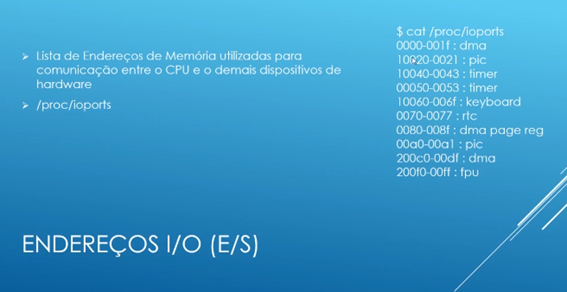

# Linux

## 101.1 Arquitetura do sistema
- BIOS – Basic Input Output System
- POST: Power-On Self-Test
- Gerencia Dispositivos, IRQ, I/O, DMA, etc.
- Inicia o processo de Boot
- EFI( Extensible Firmware Interface)
- UEFI(Unified EFI)
- IRQ – Interrupt request, sinal enviado para a CPU que o dispositivo pede sua execução.

- Como ver os mapeamentos: cat /proc/interrupts
- Endereços de I/O. Entrada de sistemas: cat /proc/ioports

- Endereços DMA: Canal do dispositivo para a memória diretamente
- Cat /proc/dma

- Barramentos
   - PCI: comando lspci
   - USB: comando lsusb
- Lsusb -s bus:device (mostr+a os detalhes)

- Partição virtual: contém informações do sistema em sua execução. Cada vez que liga a máquina, ele monta os dispositivos e dinamicamente vai sendo alterado
  - /proc: informações de processos ativos e recursos de hardware
  - /sys: informações sobre dispositivos de hardware(sysfs)
  - /dev: referências aos dispositivos do sistema, inclusive de armazenamento (udev)
  - Udev: = device mananger, ele que referencia os dispositivos no /dev
  - Dbus/hald = comunicação entre processos. Informa os processos a situação dos dispositivos de hardware.

Cat /proc/cmdline: parâmetros que o bootloader passou para o kernel quando estava iniciando
/proc/filesystem: os tipos de filesystem que podemos usar
/proc/mount: as partições montadas no sistmas

Udev
Os axu | grep udev : Criar as ligações dos dispositivos conectados e monitora o que acontece no seu hardware.
/lib/udev/rules.d : ações/regras de adição dos dispositivos
/etc/udev/rules.d: o administrador pode criar suas próprias ações/regras

Dispositivos de armazenamento
PATA ou IDE (Parallel Advanced Technology Attachment):
/dev/hda ou das – Master
/dev/hdb ou sdb – slave
/dev/hdc ou sdc – máster
/dev/hdd ou sdd – slave
Hoje a maioria dos servidores mapeia como DAS e SDC porque são scsi

SATA ( Serial Advanced Technology Attachment)
/dev/sda – Primeiro Disco
/dev/sdb – Segundo disco
/dev/sdc – Terceiro disco

SCSI  (Small computer System Interface)
Tipos
	8 bits(7 + controladora)
	16 bits(15 + controladora)
SCSI_ID
Canal – identificador de cada adaptador
ID – identificador de cada dispositivo
LUN – Número lógico da unidade
Mapeados no Linux
	/proc/scsi/scsi
Outros dispositivos
/dev/fd0 – disquete
/dev/scd0 – SCSI CD-ROM
/dev/sr0 – SCSI DvD.

Modulos
Todos dispositivo precisa de uma implementação de código, pode ser via código do kernel ou você tem módulos para cada um dos dispositivos. {equivalente aos drivers}
Sempre estarão no /lib/modules
Cada conjunto de módulos esta associada a um kernel
Uname -r : verifica a versão do kernel
/etc/modules: Você pode determinar quais módulos você quer que carregue obrigatoriamente

Lsmod (/proc/modules)– lista os módulos carregados neste momento.
Pode ser que um módulo tenha dependência: listado na coluna USED BY
Modinfo “modulo”, exibe outras informações do modulo
Rmmod “nomedomodulo” : Remover o Modulo
Insmod “caminhodomodulo”, insmod /lib/modules/4.8.0-46-generic/kernel/drivers/input/mouse/psmoude.ko
O Insmod não carrega as dependências.
Modprobe(mapeia as dependências dos módulos) : modprobe bluecard_cs
Modprobe -r bluecard_cs (remove)

Você pode usar arquivos de configuração para o modprob(/lib/mobdprod.d) para determinar ou configurar algo

